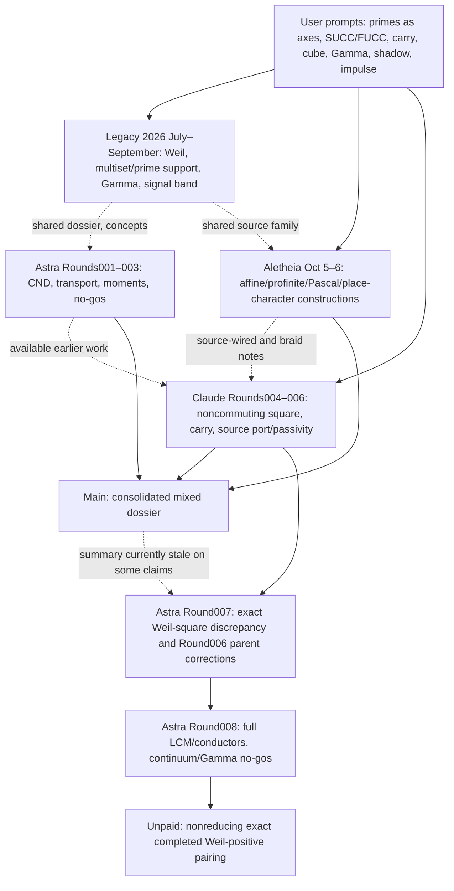

# RH research lineage, inheritance and source-independence audit (2026-10-07)

**Purpose.** Record how *user-origin prompt ideas* became agent mathematics across branches and which conclusions were subsequently corrected. This document is an **influence and dependency map**. It is not a scholarly novelty audit, an assertion of independent replication, or an RH result.

**Snapshot.** Main @ `b836656f9b284a35ef7e412b2af24b879ea80ed9`. Round007 PR #5 head @ `8da6cf92d276961356497486048163f0aff08233`. Round008 PR #6 head @ `90f93e655ee7e57260d6a45c168ce8dcff321601`. These were the inspected heads on 2026-10-07; links to active branch heads may later move. PR #5 and #6 were open and unmerged when this provenance record was assembled.

Consult [the prompt register](USER_PROMPT_PROVENANCE_2026-10-07.md) for `U01–U42` and [the typed atlas](SUCC_FUCC_CONCEPT_ATLAS_2026-10-07.md) for mathematical notation. GitHub source files and commit messages are evidence of *repo history*, not necessarily verbatim user phrasing.

## 1. Two graphs: genealogy is not proof

The influence graph is wider than the theorem-dependency graph:

**Solid arrow:** directly documented influence/proof-round succession or consolidation direction. **Dotted arrow:** shared concepts/sources or audit relationship, **not** verified direct git ancestry. This diagram is intentionally not an assertion that all agent families were epistemically independent.

### Hard branch ancestry we actually know

| Artifact | Grounded parent / integration | Consequence |
|---|---|---|
| Round006 frozen head `d3e29723fcf9df107fc55a75716e5255898c1b53` | Source-port/passivity round | Contains assertions subsequently corrected |
| Main consolidation | Includes Round001–006 and Aletheia histories, with unrelated histories merge as recorded in commit `dc6ea1e` | One repository history does not convert shared work into independent evidence |
| Round007 PR #5 | Built from frozen Round006 `d3e29723…`; head `8da6cf92…` | Its `PARENT_AUDIT.md` is a required corrigendum |
| Round008 PR #6 | Built from frozen Round007 `8da6cf92…`; head `90f93e65…` | Extends the audited frontier, with new scoped failures |
| New docs provenance branch | Based on Main `b836656f…`, without merging PR #5/#6 | Safe index into active branches; not a scientific merge |

For any claim, quote the **source head and file**, not just the model name or a compressed "we all converged" sentence.

## 2. Concept-to-theorem transformations with explicit authorship

| User-origin question | Agent formalization and source family | Exact result currently supported | What changed / remains open |
|---|---|---|---|
| U01–U03 local prime/additive space | Legacy multiset/prime-cone dossiers; valuation lattice | Unique factorization as prime-exponent vectors, Dirichlet lattice convolution | "Cube becomes sphere" not obtained from these facts |
| U02,U04–U07 coherent Gamma/global square | Legacy absolute/Arakelov / Weil / Gamma dossiers | Classical Weil criterion and explicit Gamma identities independently available | Intrinsic Hodge/spectral positive host unconstructed |
| U08–U09 SUCC carrier + FUCC metric | Aletheia affine braid; Claude Round004 noncommuting core | `V_p S=S^p V_p` and nontrivial commutators | Any exact completed Weil Gram identity remains unpaid |
| U10,U15 Pascal / "ways to FUCC with SUCC" | Aletheia composition/cut histories and generalized Pascal | Exact ordered-composition counts and translation matrices | This combinatorics alone has no sign theorem |
| U11–U16 interconnected self-sieving clocks | Aletheia successor LCM memory, Claude carry machine, Astra Round007 first-return maps | `Δ log L_N=Λ(N)`, induced prime-power returns, source logarithmic derivative | Full clock innovation determinant ≠ Euler product (Round008) |
| U17,U37–U41 inverse SUCC / Gamma zero ladder | Inverse-affine and Γ determinant/oscillator lines | Inverse Γ zero ladder and trivial-zero cancellation analytically correct | No causal map from these points to nontrivial zero ordinates |
| U19–U20 growing finite matrices/boundary histories | Astra Round008 full LCM filtration, product cocycle, scalar nonlinear closure | Exact refinement isometries, mixed conductor innovations, order-sensitive charge | Isometric history alone preserves orthogonality; no Weil coupling |
| U21,U26 shadows of N | Profinite odometer, graph-lattice diagonal, observation no-go | Faithful state relabeling; fixed sample/finite-jet observation loses smooth tests | An arithmetic continuum observation is necessary for full Weil |
| U22 non-random/flat encoding | CRT/refinement intertwiners and source metric | Coordinate equivalence only with all observables transported | Support-only equivalence fails for weighted/polarized kernels |
| U25–U27 loop curvature | SUCC/FUCC commutator/holonomy proposals | Certain loops and commutators exact | No canonical arithmetic connection/curvature has been derived |
| U28–U30 cube atoms/shape limits | Factor graph, valuation cone, chiral swaps | Exact factor coordinate action and identified factor-local no-go | No justified spherical limit, special rotation, or RH sign |
| U31–U34 Gamma rotation + correlated impulses | Γ heat/determinant; prime-power atomic ramps; coherent edge square | Exact distributional event measure and completed Weil-minus-energy identity | Positive-square bulk deficit and wrong cross-prime atoms in tested classes |
| U23–U24,U35–U36 prove Weil/Suzuki from SUCC | Astra Round007/008 full comparison; older Suzuki-target dossiers | Rigorous target statement and several scoped obstruction theorems | Independent global positive prime/Archimedean coupling absent |

**Ownership rule:** Prompts can motivate an operator, but the formal statement is an *agent-derived construction*, and classical facts have external mathematical authorship. The word "discovered" must be paired with exactly **what** is new: prompt insight, rederivation, explicit arithmetic calculation, certified theorem, or merely an analogy.

## 3. Source-family independence analysis

| Evidence family | Why it is useful | Shared provenance / dependency | Independence verdict |
|---|---|---|---|
| Original user messages, as recoverable | Clear evidence of question origins, phrasing, conceptual constraints | Some are recovered excerpts, not signed complete transcripts; repeated across threads | Good for **user intent**, not proof truth |
| Legacy August/September dossiers | Historical formal and negative-control context | Often assistant syntheses of prior dialogue/literature, copied into repo | **Not** independent validation of source hypotheses |
| Aletheia Oct5/6 notes | Affine, Pascal, place-character and source rewiring formalizations | Shared original prompts, same external analytic identities, sometimes reused in later rounds | Formalization family, not a blind independent witness |
| Astra 001–003 | Finite event/CND/transport experiments, independently scoped no-gos | Same Suzuki/Weil target, inherited initial materials and research brief | Distinct *method classes*; verify each proof, not counted as independent measurement |
| Claude 004–006 | Noncommuting operator, carry, Laplace-source and passivity attempts | Consulted Aletheia and earlier work; Round006 needed correction | Historical exploratory lineage; no blanket confirmation |
| Astra 007 | Exact discrepancy and parent audit; corrected proof arrows | Direct parent Round006, shared targets; new audited local proofs | Valuable **adversarial correction**, not independent theorem replication |
| Astra 008 | Full conductor/Haar/Gamma coupling, scoped boundary no-go | Direct parent Round007, same system and controls | New derived constraints, not independent global replication |
| Suzuki / Weil / Lagarias / NIST DLMF | Primary definitions and published theorems | Independently published source families, but the repo restates them | Appropriate *external mathematical provenance* |
| Multiple agents saying "same wall" | May identify a stable bottleneck | Same prompts, repo, definitions and citations can drive agreement | **Do not count as independent convergence** without ablations/holdouts |
| Repo test suites / Arb certificates | Check finite algebra and signed numerical counterexamples | Same scripts/formulas may be reused; claims of pass status are reported, not rerun in this documentation change | Evidence for stated computations **within their scope only** |

### Specific "leave-one-family-out" questions

1. Without user metaphor wording, do the standard zeta/Weil and affine operators still produce the same computed identities? (They should when the identity is truly exact.)
2. Without imported Aletheia notes, does Round007's Weil-minus-energy derivation stand by direct integration and distribution comparison? Its proof should not need the original analogy.
3. Without Round006's passivity claims, does Round007's corrected parent audit still establish its source identities and negative-square obstruction? Check the actual equations rather than the parent's summary.
4. Without any Riemann zero ordinates, can an implementation reconstruct the arithmetic source, Gamma completion, and tested coupling? The repo says yes for its existing identities; independently verify before promoting to CORROBORATED.
5. If a fake prime list or altered `log p` weights still gives the same global "proof", which alleged insight is actually arithmetic-specific?

These are proposed **ablation criteria**, not reported reruns.

## 4. A correction that must remain visible

The following Round006 `main`-era claims **must not be inherited as facts**:

- `Re(\xi(s)/\xi(s+1))≥0` is equivalent to RH. **Refuted** as a claimed replacement for `Re(\xi'/\xi)>0`; their positivity conditions differ.
- `\psi(s/2)/2` is passive merely from its pole locations. **Refuted** by its negative value at `s=2`.
- A single pole gives a finite negative-square count, and negative excursions count Cayley poles. **Refuted** under the stated reasoning.
- Conrey–Li makes the positive Hilbert norm indefinite. **Incorrect**; their result addresses extra translation positivity.
- An unrestricted boundary theorem proves all source-response methods fail. **Unverified**; the particular finite completion failure is far narrower.

What survives: a **conditional Schur–Vitali analytic continuation argument**, exact source/Gamma formulas with proper normalization, and separately established scope-limited no-gos. Read [Round007 PARENT_AUDIT at inspected SHA](https://github.com/femboy2112/FuckingRH/blob/8da6cf92d276961356497486048163f0aff08233/research/astra_round_007/PARENT_AUDIT.md) before reusing Round006. The later reports explicitly state these corrections.

The older `main` README and `CURRENT_STATE` are historical snapshots until an authorized scientific integration updates them. This documentation branch intentionally **does not rewrite** the research claim ledger or merge scientific round branches.

## 5. Provenance error classes to guard against

| Failure mode | Example | Preventative invariant |
|---|---|---|
| Authorship laundering | An agent term appears later inside a "user vocabulary" glossary | Quote user message explicitly, or label as agent-derived |
| Discovery laundering | Classical `-\zeta'/\zeta` Euler identity advertised as a new SUCC theorem | Cite classical identity; specify new coordinate view only |
| Equivalence laundering | Recast Weil positivity as new finite Gram and declare proof | Identify independent sign-bearing arrow and all limits |
| Precision laundering | Numeric zero agreement or a few PSD matrices become an all-order theorem | State finite sample, precision, holdout, and missing tail estimate |
| Source duplication | Same Suzuki formula copied in several agent notes counted as consensus | Normalize to one primary-source family plus distinct derivations |
| Parent inertia | Round006 incorrect shifted-ratio claim inherited by a subsequent summary | Apply Round007 corrigendum every time |
| Basis/interaction confusion | CRT relabeling presented as new cross-conductor physics | Compare transported complete operator/algebra, not labels |
| Phase overreach | Gamma phase presented as a vector rotating by 90° | Declare the common Hilbert-space transport and angle |
| Rank camouflage | Boundary finite repair asserted to cancel an infinite bulk identity deficit | Compute full polarized form, essential spectrum and norm scaling |

## 6. Source priority for future sessions

1. **Primary sources** for canonical theorem definitions and exact assumptions (Suzuki 2023, Weil explicit-formula criterion, Lagarias for log-derivative positivity, NIST for Γ/digamma).
2. **Current audited research branch head** for *new in-repo* scoped theorems, scripts, raw evidence and corrected premises.
3. **Frozen earlier branch** when tracing historical lineage — never alone when a later corrigendum exists.
4. **User prompt register** for research objectives, analogical semantics and original formulations — not for proof claims.
5. **Assistant/agent summaries** for navigation only until the claimed equations are checked.

Latest primary anchor: [Suzuki, *Aspects of the screw function corresponding to the Riemann zeta-function* (JLMS, 2023)](https://londmathsoc.onlinelibrary.wiley.com/doi/10.1112/jlms.12785).

## 7. What would count as genuinely independent corroboration?

For a candidate H1 nonreducing coupling, commission one derivation starting from Suzuki's completed distribution without reference to the proposed SUCC operator, and another starting from explicit SUCC/FUCC/LCM/Gamma operators with no use of the target sign. Compare **polarized kernels**, not merely their diagonal energies or moment summaries. Require the same result after:

- a clean-room implementation of the small prime-power/conductor example;
- analytic calculation of the `log(3/2)` coefficient and bulk identity debit;
- deletion/mutation of at least one prime weight;
- a separate proof of convergence and its exact topology;
- synthetic signed/off-line-zero negative controls when logically applicable.

A common result would become CORROBORATED only after the source families and implementation dependencies truly differ and the cross-checks survive. Matching recycled expressions or multiple reviews by the same model do not qualify.

## 8. Scope of this documentation addition

This document and its companions create **navigation and provenance**, not new mathematics. No GitHub code was changed, no research claim in `CLAIM_LEDGER.md` was promoted, and no Round007/008 branch was merged. The user supplied permission to write useful provenance to the repository; integration remains a separate reviewed decision.

**Claim ledger disposition:** the only "disclosed" assertions in this note are elementary identities or correctly bounded literature/repo statements with explicit pointers. All bridges from the user's speculative Gamma/curvature/cube language to a positive completed Weil object remain **UNVERIFIED**. RH is open.
