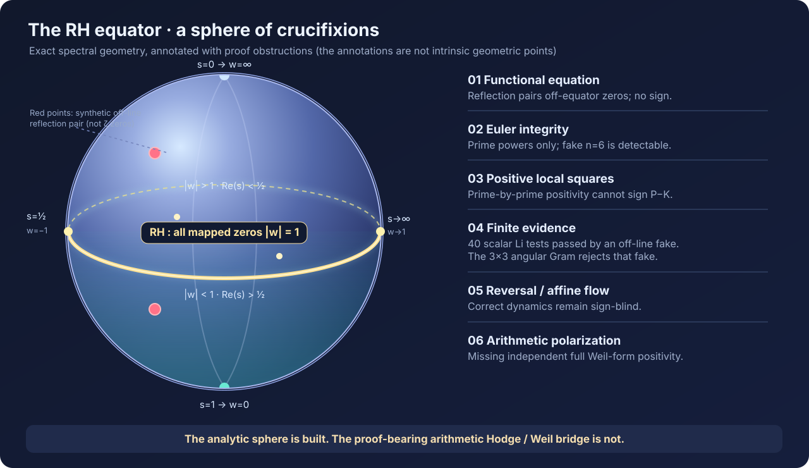

# The Riemann sphere of crucifixions — an exact equator and a proof-obstruction atlas

**Research checkpoint, 2026-10-09. RH IS OPEN.** A synthesis built on main commit
8505467ea596b0636f73b655c521f50105d8b06e (through Round 067), also cross-reading the still-open
2026-10-09 PRs #8–#11. This is a new *coordinate-level synthesis and exact synthetic test suite*,
NOT a new zero-free theorem or a proof-bearing arithmetic positivity result.

The user's image is retained in its strongest coherent form: we can describe a geometric
surface on which the RH zero condition lives, classify where our attempted methods fail,
and test which barriers are genuine logical no-gos versus absences of a source-derived
polarization. **The Riemann sphere is not the missing arithmetic self-product.** Its
surface is fully accessible; the unpaid theorem concerns a *global sign*.

## 1. The literal sphere (DISCLOSED, elementary)

Let \(\widehat{\mathbf C}=\mathbf C\cup\{\infty\}\) and use the Möbius coordinate

\[
w=M(s)=\frac{s-1}{s}=1-\frac1s,\qquad s=\frac1{1-w}.
\]

Exactly,

\[
\Re s=\tfrac12\ \Longleftrightarrow\ |s-1|=|s|
\ \Longleftrightarrow\ |w|=1.
\]

The \(w\)-unit circle is the equator under ordinary stereographic projection.
The disk \(|w|<1\) is \(\Re s>1/2\); its outside is \(\Re s<1/2\).

| Spectral point in the \(s\)-plane | Point on the \(w\)-sphere |
|---|---|
| \(s=0\) | \(w=\infty\) (north pole) |
| \(s=1\) | \(w=0\) (south pole) |
| \(s=\tfrac12\) | \(w=-1\) (equator) |
| \(s=\infty\) | \(w=1\) (equator) |
| \(s=\tfrac12+it\), real \(t\) | a point of \(|w|=1\) |

Write
\[
\xi(s)=\tfrac12s(s-1)\pi^{-s/2}\Gamma(s/2)\zeta(s).
\]
It is entire, satisfies \(\xi(s)=\xi(1-s)\) and
\(\xi(\overline s)=\overline{\xi(s)}\), and its zeros are the nontrivial
zeta zeros. They lie within \(0<\Re s<1\).

Thus, because the functional equation sends any zero left of the critical
line to a zero right of it,

\[
\boxed{\mathrm{RH}\iff \text{each mapped \(\xi\)-zero lies on \(|w|=1\)}
\iff \xi(1/(1-w))\text{ has no zeros on }|w|<1.}
\]

**Precision at the compactification:** \(\xi(1/(1-w))\) has an essential
singularity at \(w=1\), the image of \(s=\infty\). Its infinitely many
zeros have possible accumulation only at this boundary point. It is not
a meromorphic function on the entire compact sphere, nor is its
infinite zero set a finite divisor on that compact sphere. The divisor
language refers to the zeros of \(\xi\) on the ordinary affine \(s\)-plane.

**Never confuse** the spectral point \(s=\infty\) in this chart with the
*archimedean place* \(v=\infty\) of \(\mathbf Q\). They are distinct
objects despite both being named infinity.

## 2. Three involutions and a twistor non-identification (DISCLOSED)

| Operation in \(s\) | Operation in \(w\) | Fixed locus |
|---|---|---|
| Functional equation \(s\mapsto 1-s\) | \(w\mapsto 1/w\) (holomorphic) | \(w=\pm1\) |
| Complex conjugation \(s\mapsto\overline s\) | \(w\mapsto\overline w\) | real \(w\)-circle |
| Critical-line reflection \(s\mapsto 1-\overline s\) | \(w\mapsto1/\overline w\) (antiholomorphic) | **the RH equator** \(|w|=1\) |
| Antipodal twistor map | \(w\mapsto-1/\overline w\) | **none** |

The last map is the antipodal real structure appearing on the complex
projective line in the 2026 Connes–Consani absolute-twistor setting. It is
NOT the zero-divisor reflection defining our equator. The distinction is
decisive: \(w=1/\overline w\) has the whole equator as fixed locus, whereas
\(w=-1/\overline w\) would demand \(|w|^2=-1\). There is no automatic
identification of the arithmetic twistor real structure with the
RH-reflection involution. Any such identification must be constructed
and checked, not assumed from the word 'sphere'.

## 3. Li's criterion is an angular measurement of the equator (DISCLOSED)

The same coordinate appears in Li's coefficient formula:

\[
\lambda_n=\sum_\rho\left[1-\left(1-\frac1\rho\right)^n\right]
=\sum_\rho(1-w_\rho^n),\qquad n\ge1.
\]

The zero sum uses its standard symmetric limiting convention. Bombieri–Lagarias
establish the equivalence \(\mathrm{RH}\iff\lambda_n\ge0\) for every \(n\ge1\).
Let

\[
G(w)=\log\!\frac{\xi(1/(1-w))}{\xi(1)}
=\sum_{n\ge1}\frac{\lambda_n}{n}w^n
\]
near \(w=0\). Since the disk is simply connected, \(G\) extends
holomorphically to \(|w|<1\) precisely when its exponentiated argument is
zero-free there. Therefore

\[
\mathrm{RH}\iff G\in\mathcal O(\mathbb D)
\iff\limsup_{n\to\infty}|\lambda_n|^{1/n}\le1.
\]

The last equivalence uses Cauchy–Hadamard and the irrelevant \(n^{1/n}\to1\).
These are **reformulations**, not arithmetic bridges or proofs.

### An angular negative-type / Gram reformulation (DISCLOSED)

Define \(\psi(n)=\lambda_{|n|}\) on \(\mathbf Z\), with \(\psi(0)=0\).
Under RH, \(w_\rho=e^{i\theta_\rho}\); conjugation pairs give the
convergent fixed-\(n\) expression

\[
\psi(n)=\sum_\rho (1-\cos(n\theta_\rho)).
\]

Each \(1-\cos(n\theta)\) is conditionally negative definite on
\(\mathbf Z\), hence so is the convergent nonnegative sum. The corresponding
Schoenberg Gram matrices have entries

\[
K_{jk}=\psi(j)+\psi(k)-\psi(j-k)
=\lambda_j+\lambda_k-\lambda_{|j-k|},\qquad j,k\ge1.
\]

They are PSD under RH. Conversely, positivity of *all* such Gram matrices
implies each \(\lambda_j=K_{jj}/2\ge0\), so Li's theorem gives RH.
We therefore have an exact **angular-correlation equivalent criterion**.
It inherits RH's proof debt; calculating a finite PSD matrix proves
nothing globally.

This is the sphere version of the completed Weil/Suzuki negative-type
target, **not an independent third witness**. Correlation matrices can,
however, be much stronger *finite falsifiers* than individual
coefficient checks for proposed surrogate constructions.

## 4. Crucifixion #1 — finite Li positivity is blind (DISCLOSED)

Consider the synthetic symmetric quartet

\[
Z_{a,t}=\{\tfrac12+a+it,\ \tfrac12+a-it,\
\tfrac12-a+it,\ \tfrac12-a-it\},\quad 0<a<\tfrac12,\ t>0.
\]

This is a multiset of fake zeros, not a zeta-zero input.

For **any prescribed finite \(N\)**, there exists \(a>0\) so that
\(\lambda_n(Z_{a,1})>0\) for \(1\le n\le N\), even though every member is
off the critical line. Proof: at \(a=0\) the quartet collapses to doubled
critical-line pairs with \(w=3/5+4i/5\) and conjugate. This \(w\) is not a
root of unity: \(w+\overline w=6/5\) would have to be a rational algebraic
integer, hence an integer. Thus for every \(n\ge1\),
\(\lambda_n(Z_{0,1})=4(1-\cos(n\theta))>0\). Continuity in \(a\) for the
finite set of \(n\)'s establishes the assertion. **Scope: arbitrary
symmetric zero multisets, NOT genuine Euler-product L-functions.**

Exact, zero-free-input controls:

- At \(a=1/4,t=1\), the first five synthetic Li sums are positive,
  but \(\lambda_6=-309804177801344/5892961181640625<0\).
- At \(a=1/4096,t=1\), **all first 40** synthetic Li sums are strictly
  positive, computed with exact rational pairs.
- For **both** off-line controls, the *\(3\times3\)* matrix
  \((\lambda_j+\lambda_k-\lambda_{|j-k|})_{j,k=1}^3\)
  has a **negative exact determinant**. The \(a=0\) on-line
  Gram is positive semidefinite, as all its principal minors confirm.

This establishes a **finite diagnostic separation**: the Gram probe
detects these off-line synthetic configurations earlier than their
scalar Li sign checks. No theorem says it does so uniformly or that
source-side finite Gram positivity can be proven for genuine \(\xi\).

## 5. Crucifixion #2 — finitely many entire-function jets are blind (DISCLOSED)

Take an arbitrary finite set of sampling points \(z_1,\dots,z_m\)
and a jet order \(k\ge1\). Set \(u(s)=(s-\tfrac12)^2\),
\(u_j=u(z_j)\), and choose an off-line nonreal point \(\rho\) whose
\(u(\rho)\) is nonreal and avoids the finite sampled \(u_j\) and their
conjugates. Define the real-coefficient polynomial

\[
q(u)=\prod_{j=1}^m[(u-u_j)(u-\overline{u_j})]^k.
\]

Choose real constants \(A,B\) uniquely satisfying

\[
q(u(\rho))(A+B\,u(\rho))=-1
\]
(two real linear equations; solvable because \(\Im u(\rho)\ne0\)).
Put \(H(s)=1+q(u(s))(A+B\,u(s))\). Then:

1. \(H(1-s)=H(s)\) and \(H(\overline s)=\overline{H(s)}\).
2. \(H(\rho)=0\) and symmetry forces the full off-critical quartet.
3. \(H(s)-1\) vanishes to order at least \(k\) at every sampled \(z_j\).

For any entire real/FE-symmetric baseline \(E(s)\), the modified
\(F(s)=E(s)H(s)\) shares all its jets of order \(0,\dots,k-1\) at
each \(z_j\), preserves both symmetries, and acquires off-critical zeros.
Choose, for example, the order-one entire baseline
\(E(s)=\cosh(\pi(s-\tfrac12))\), whose zeros all lie on the critical line.
Then \(F\) remains order one. The symbolic probe calibrates the same
multiplier using the polynomial baseline \(E(s)=(s-\tfrac12)^2+1\).

**Boundary:** this adversary does *not* preserve the Euler product,
completed zeta growth constants, exact explicit formula, or all
arithmetic constraints. It proves that **finite local analytic data and
reflection symmetry alone** cannot enforce a global zero locus. It does
not imply RH is undecidable, unprovable, or inaccessible via arithmetic.

## 6. The obstruction surface: atlas of repository crucifixions

The labels below are proof-obligation **annotations**, not intrinsic
geometric marked points on the Riemann sphere. We have not constructed
a sheaf or a bundle identifying each failed method with a sphere point.

| Atlas patch | Established access | Crucifixion / missing step | Repo provenance |
|---|---|---|---|
| Reflection / analytic completion | \(\xi\) entire; FE; equator fixed by \(w\mapsto1/\overline w\) | Symmetry is sign-blind: off-equator symmetric quartets exist | Round 63, Negative Controls 1–4 |
| Finite integer source | \(-\zeta'/\zeta=\sum\Lambda(n)n^{-s}\); true prime powers | Euler source fidelity is necessary, not a sign theorem; fake mixed-composite impulse at \(6\) detectable | DLEWC, PR #8, wiki 8.4 |
| Local prime energies | Positive repaired \(D_p\), \(B_p\), explicit \(\sigma_p\ge0\) | Positive local summands do not prove \(P-K\ge0\); divergent correction and pole/arch signs | CLAIM C90–C101, wiki 8.1 |
| Adelically coupled places | Product formula; half-density \(p^{-k/2}\); unit-basepoint jets | Signed *global* Weil polarization does not follow from modulus/first-jet identities | C110–C111, wiki 8.3 |
| SUCC/FUCC affine braid | \(V_mS=S^mV_m\); mixed commutators, \(\log p\) weights | Kinematics also survives bad arithmetic; no independent coercive completion | Round 65, DLEWC, wiki 8.5 |
| Chronology / time reversal | Projected adjoints, full-environment reversals, rational echoes | Reversibility/symmetry alone does not give a **positive** Hilbert metric or Weil sign | Round 63, PR #9 |
| Spectral/operator positivity | Weil/Suzuki/Pick and finite-Hankel formulations | Endpoint global positivity equivalent to RH; local positive-real ports insufficient | C103–C109, wiki 8.2 |
| Finite-window instruments | Prime–Gamma \(Q_L=P_L-K_L\) and calibrated DH comparisons | Finite PSD margins collapse; no uniform analytic exhaustion | Consolidated §8, wiki 8.1, 8.4 |
| Function-field Hodge route | Genuine curve self-product and Hodge-index method over \(\mathbf F_q\) | Need a source-rigid arithmetic *correspondence/intersection form* with the completed Weil sign | Round 64, PR #10–#11 |
| Absolute geometry / twistor | Curve-level RR and Serre duality already constructed; 2026 twistor framework | Those objects do not identify the required self-product pairing; antipodal \(\ne\) equator reflection | Connes–Consani 2023/2026, PR #11 |
| Superconductor / circuit | Prime-power incidence; continuous scaling versus finite logarithmic orbits | Completion, transport and literal spectral-gap analogy do not create losslessness | Round 66, wiki 8.9 |
| QM / spectral host | Self-adjoint \(\log n\), completed zeta partition functions | Its eigenvalues are \(\log n\), not ordinates of nontrivial zeros; no RH-bearing spectral identification | R57–R59, wiki 8.9 |
| Multi-route branch catalog | Roughly 47 branches, grouped by ~25 framings | Shared source/lineage does NOT multiply independent evidence | R55–R56, wiki 8.0–8.8 |

The atlas projects **all primary classes** in
[the canonical 47-branch catalog](../../wiki/08-the-reformulations-catalog.md)
onto the single proof obligation rather than duplicating every branch's
account. See also [negative controls](../../docs/NEGATIVE_CONTROLS.md)
and the [claim ledger](../../CLAIM_LEDGER.md). The PRs #8–#11 are
**unmerged research reports**; their assertions are leads requiring
separate audit, not inherited proofs.

## 7. The actual missing theorem: a sign-bearing bridge

Let \(Q_{\chi,L}(f)=A_{\chi,L}(f)-K_{\chi,L}(f)\) be the
completed *source-defined* Weil form on a declared shared test space,
with the true primitive Euler data, archimedean Gamma contribution, and
pole term in the trivial-character case. The RH case has \(\chi=1\).

**A candidate progress certificate must pass all four gates:**

1. **E/U/D arithmetic integrity:** exactly derive the prime-power log
   derivative (including half-density), genuine unitary local Hecke
   characters where applicable, and the independent clock \(\log n\).
   Reject a fake primitive atom at \(6\), a nonunit local parameter, and
   a shifted \(\log2\).
2. **FULL Weil identification:** prove a polarized, limit-controlled
   equality between the proposed geometrically positive pairing and
   *all* of \(Q_{\chi,L}\), not its positive Euler subset, its pointwise
   scalar restriction, or a Cholesky square root constructed from \(Q\).
3. **INDEPENDENT sign theorem:** establish nonnegative Hodge-index,
   intersection, or genuine Hilbert norm from source geometry *without*
   assuming RH, a spectral zero list, positive \(Q\), or an all-\(L\)
   limit already equivalent to the conclusion.
4. **Exhaustion and mutation discrimination:** extend the identity and
   sign over the required complete test space/all windows; prove
   convergence and boundary control. A mutation-invariant parent or
   finite-only result fails as a proof.

If all four were genuinely proven for zeta, Weil's classical criterion
would give RH. We have **not** constructed such a parent. This is a
precise missing lemma/construction, not a claim that it exists.

## 8. Documentation debt discovered while making the map

These are claims to correct in their original files in a separately
reviewed pass; this branch does not silently rewrite the governing ledger.

- **Round 66's phrase "zero current at every composite" is false.**
  \(\Lambda(4)=\log2>0\), even though \(4\) is composite. The exact
  support condition is: zero at integers which are **not prime powers**
  (e.g. \(6,10,12\)); prime powers are allowed. DH has an extra
  *primitive mixed-composite* coefficient at \(6\).
- **CLAIM C108 conflates two conditions.** RH-equivalent
  \(\Re(\xi'/\xi)(s)>0\) on \(\Re s>1/2\) is *not the same* as
  \(\Re(\xi(s)/\xi(s+1))\ge0\) on the same half-plane. The latter is
  refuted by the repo's own numerical counterexample and already
  tombstoned in README/wiki 02; C108's parenthetical "i.e." must not
  be read as an equivalence.
- **Round 66's 200-level-spacing probe** is a finite statistic, not a
  theorem that the infinite spectrum has no hard gap. The
  superconductor analogy must not identify zero spacing with a physical
  superconducting excitation gap.
- **"The DH primitive n=6 leakage IS its off-line zeros" is too strong.**
  The coefficient defect and off-line zeros are observed together in
  that control; a direct causal theorem from one defect to the specific
  zero pattern was not proven.
- **"No arithmetic Riemann–Roch / duality exists" is false.**
  Connes–Consani's 2023 RR and Serre duality are established; the
  missing result is the correct *RH-bearing self-product
  correspondence/Hodge-index sign*, as PR #11 explicitly notes.
- **No Riemann-sphere compactness shortcut:** compactness of the
  *spectral* Riemann sphere does not supply the compact
  *arithmetic geometry* or the independent Weil polarization.

## 9. The next discriminating probe (CONJECTURED as research strategy)

**Angular source-Gram challenge.** Use only arithmetic source coefficients
\(\Lambda(p^k)p^{-k/2}\), the degree/log clock, and the required
Gamma/pole completion to derive the finite Li coefficient arrays by
the explicit formula (or by independently justified analytic
derivatives at \(s=1\)). Then demand that a proposed *source-native*
inner product produce every finite angular \(K_{jk}\) with independently
positive Gram structure and a rigorous all-\(N\) compatibility/exhaustion
theorem. Controls before interpreting any positive outcome:

- Positive: exact on-equator synthetic quartets.
- Negative: the off-equator \(a=1/4\) and \(a=1/4096\)
  quartets; the latter passes 40 scalar Li inequalities but fails the
  \(3\times3\) Gram.
- Arithmetic mutations: fake \(6\), nonunit \(p=2\), wrong \(\log2\),
  gamma/pole omission, and DH.
- Null: a generic Gram that remains PSD when the source is mutated;
  declare it RH-inert, even if numerically beautiful.

**Pass:** a genuinely source-derived full-form equality and noncircular
global positive parent, both audited independently. **Fail:** sign
survives the fake arithmetic; the claimed source equality breaks;
or a single indefinite source Gram is provably obtained. **Ambiguous:**
finite windows PSD, tiny eigenvalues comparable to conditioning error,
or no exhaustion theorem. No zero ordinates may be construction input.

This is a better *discriminator and representation* of the fourth gate,
not an easier theorem by definition. The new correlation matrix
construction is a useful probe only insofar as it distinguishes source
constructions that scalar sign checks cannot.

## Reproduction and primary literature

Run:
- python scripts/riemann_sphere_atlas_probe.py
- python -m pytest -q tests/test_riemann_sphere_atlas.py

The new synthetic controls were executed locally with SymPy + exact
fractions: all five dedicated tests passed. No existing full suite
or remote CI has been claimed to pass.

Primary/checkable references:
- NIST DLMF §25.4 and §25.10 (xi-function, functional equation, zeros): https://dlmf.nist.gov/25.4 and https://dlmf.nist.gov/25.10
- Bombieri–Lagarias, *Complements to Li's Criterion for the Riemann Hypothesis* (1999): https://websites.umich.edu/~lagarias/doc/bombieri.pdf
- Connes–Consani, *Riemann–Roch for the compactified arithmetic curve* (2023): https://arxiv.org/abs/2205.01391
- Connes–Consani, *The Absolute Twistor Line and the Geometry of Spec Z* (2026): https://arxiv.org/abs/2609.00299

**Ledger verdict:** Geometry, involution separation, conditional-negative-type equivalence,
finite-Li no-go, and finite-jet construction are **DISCLOSED** within the
stated analytic/synthetic scope. The exact signs are **OBSERVED by executed
rational/symbolic tests**, backed by proofs of their mathematical form.
The source-derived arithmetic polarization remains **UNVERIFIED / OPEN**.
The fourth gate has not moved. RH remains open.
