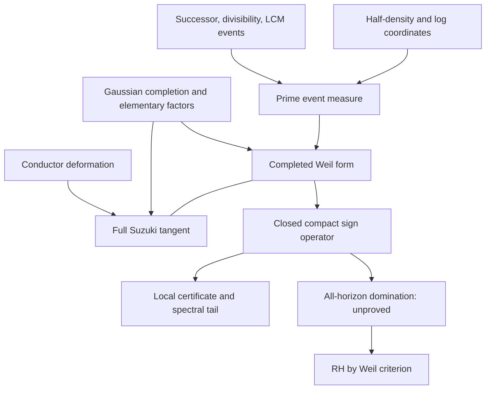

# Provenance, claims, and the remaining theorem

**Date:** 2026-10-07. **RH status:** open.  
**Branch:** `research/succ-weil-suzuki-rigorous-bridge-2026-10-07`.  
**Frozen parent commit:** `987a67d891879e966c9e0c7fb533a5dc74f805fd`.  
**Frozen parent tree:** `6d43c4b9426b22e4af487f7ec0da8de63553b8d6`.

The research session and recorded finite execution began on October 7; final repository publication crossed midnight UTC into October 8. The branch and directory retain the session-start date.

This file follows [the repository research-provenance template](../../../docs/RESEARCH_PROVENANCE_TEMPLATE.md) and supplements [the governing claim provenance ledger](../../audits/2026-10-07/RH_CLAIM_PROVENANCE_LEDGER.md). Historical entries and corrections are retained on the parent line.

## 1. Authorship and chronology

Leah supplied the recurring successor/fucc, clock, carry, Gamma, and prime-event questions, requested a rigorous route to Weil/Suzuki, and then explicitly requested that the derivation be written to the repository and developed further. GPT-6 generated this round's synthesis, proofs, code, and bounded same-model source/adversarial checks. These roles are distinct from external mathematical authorship and from the connected GitHub account used to create commits.

The separate user-origin register and concept atlas were inspected at the immutable commit `05516d54f1618d8fcabbec0e54bc2b53e208429b`:

- [User prompt provenance](https://github.com/femboy2112/FuckingRH/blob/05516d54f1618d8fcabbec0e54bc2b53e208429b/docs/USER_PROMPT_PROVENANCE_2026-10-07.md).
- [Succ/fucc concept atlas](https://github.com/femboy2112/FuckingRH/blob/05516d54f1618d8fcabbec0e54bc2b53e208429b/docs/SUCC_FUCC_CONCEPT_ATLAS_2026-10-07.md).
- [Probe and proof-obligation ledger](https://github.com/femboy2112/FuckingRH/blob/05516d54f1618d8fcabbec0e54bc2b53e208429b/docs/SUCC_FUCC_PROBE_LEDGER_2026-10-07.md).
- [Lineage and source-independence audit](https://github.com/femboy2112/FuckingRH/blob/05516d54f1618d8fcabbec0e54bc2b53e208429b/docs/RH_LINEAGE_SOURCE_INDEPENDENCE_2026-10-07.md).

Those files distinguish recovered excerpts from paraphrases and assistant formalizations. This bundle does not promote their excerpts to a complete authenticated chat transcript. They are conceptual lineage, not mathematical proof dependencies. Their branch is linked, not merged wholesale into the newer audit parent.

**First appearance of this complete bundle:** the initial mathematical commit on the branch named above. The immediate provenance follow-up pins its exact SHA here after the Git object has been created. Earlier derivations of component identities are recorded below; this field is not a priority claim.

## 2. Primary mathematical sources

| Key | Author, title, exact version | Used statements and limits |
|---|---|---|
| S12 | Masatoshi Suzuki, *A canonical system of differential equations arising from the Riemann zeta-function*, [arXiv:1204.1827v2](https://arxiv.org/pdf/1204.1827v2), revised 2016-09-23 | Proposition 2.1, equations (2.1)–(2.4), Theorem 2.2, Section 4: the shifted-xi ratio, arithmetic coefficients, causal kernel, and finite Hankel construction. The canonical-system construction's source range is \(\omega>1\); local \(L^1\) kernels for every \(\omega>0\) and the tangent are separately proved here. |
| S23 | Masatoshi Suzuki, *Aspects of the screw function corresponding to the Riemann zeta function*, [arXiv:2206.03682v4](https://arxiv.org/pdf/2206.03682v4), revised 2023-05-30 | Equations (1.1)–(1.3), Theorem 1.1, Theorem 1.7, Section 3.2, Proposition 3.1, and (5.15): \(\Psi\), transform, screw/Weil connection, explicit formula, and RH criteria. Pointwise \(\Psi\ge0\) is a special theorem for this \(\Psi\), not a generic kernel principle. |
| S26 | Masatoshi Suzuki, *Weil's quadratic form via the screw function*, [arXiv:2606.09096v3](https://arxiv.org/html/2606.09096v3), revised 2026-09-23 | Theorem 1.4 and Sections 2.2–2.5, especially (2.3)–(2.7): origin normalization and localized Weil operators; short-interval positivity has prior literature. The present argument uses local distributions and does not inherit an unsupported global-temperedness inference from continuity. |
| G | NIST DLMF, [5.7.6](https://dlmf.nist.gov/5.7.E6), [5.9.16](https://dlmf.nist.gov/5.9.E16), [5.11.2](https://dlmf.nist.gov/5.11.E2), [5.12.1](https://dlmf.nist.gov/5.12.E1) | Digamma partial fractions, its integral, asymptotic, and Euler beta integral. These identify the exact Gamma multiplier and causal kernel. Asymptotic formulas are not used as finite error certificates. |
| T | NIST DLMF, [25.4](https://dlmf.nist.gov/25.4), [25.5](https://dlmf.nist.gov/25.5) | Classical completion, functional equation, and Mellin representations. Gaussian completion is additional analytic input, not an output of an abstract successor relation. |
| F | Classical Fourier and operator theory | Plancherel, Tonelli, normalized-power distributions, the spectral and closed-form representation theorems, Kolmogorov–Riesz, Bessel/min-max, rank-one interlacing, Cauchy–Schwarz, and the two-by-two Schur bound. The applications and estimates needed here are proved in the notes; these tools are not claimed as new results. |

Versioned equation/theorem references are the authoritative locators; HTML and PDF pagination may differ. The three arXiv title/version records were checked directly during this write-up. The source proofs are external results, while the exact local kernel differentiation and the operator applications are repository derivations requiring mathematical review on their merits.

## 3. Repository predecessors that remain credited

| Component | Immutable source | Treatment in this bundle |
|---|---|---|
| Unilateral successor boundary and von Mangoldt operator | `7168fd188adbccacbf0c22c17931aeccee5dd906`, [VON_MANGOLDT_AS_SUCC_BOUNDARY.md](https://github.com/femboy2112/FuckingRH/blob/7168fd188adbccacbf0c22c17931aeccee5dd906/research/claude_round_006/VON_MANGOLDT_AS_SUCC_BOUNDARY.md) | Retained with the one-sided space and prime weights declared. No claim that deleting zero creates primes. |
| Finite conductor/Haar model and Suzuki factorization | `8873b562c294b72749033907c12d1d2879c63234`, [DISCRETE_CONDUCTOR_SUZUKI_FACTORIZATION.md](https://github.com/femboy2112/FuckingRH/blob/8873b562c294b72749033907c12d1d2879c63234/research/aletheia_2026-10-06/DISCRETE_CONDUCTOR_SUZUKI_FACTORIZATION.md) | Retained with normalized maps between different moduli. A finite number of conductor channels still has a continuum function factor. |
| Arithmetic first derivative | `0840c3905f27b96f8d6011d85523130ffbab48aa`, [OMEGA_ZERO_CONDUCTOR_JET.md](https://github.com/femboy2112/FuckingRH/blob/0840c3905f27b96f8d6011d85523130ffbab48aa/research/aletheia_2026-10-07/OMEGA_ZERO_CONDUCTOR_JET.md) and [CONDUCTOR_FIRST_JET_WEIL_OPERATOR.md](https://github.com/femboy2112/FuckingRH/blob/0840c3905f27b96f8d6011d85523130ffbab48aa/research/aletheia_2026-10-07/CONDUCTOR_FIRST_JET_WEIL_OPERATOR.md) | The prime tangent is retained. SWS-002 completes the Gamma/elementary/contact matching on a compact smooth core; SWS-003 specifies the topology that fails. |
| Exact Gamma/prime energy, scalar deficit, and screw pushforward | `8da6cf92d276961356497486048163f0aff08233`, [WEIL_SQUARE_ATTEMPT.md](https://github.com/femboy2112/FuckingRH/blob/8da6cf92d276961356497486048163f0aff08233/research/astra_round_007/WEIL_SQUARE_ATTEMPT.md) and [SUZUKI_PUSHFORWARD.md](https://github.com/femboy2112/FuckingRH/blob/8da6cf92d276961356497486048163f0aff08233/research/astra_round_007/SUZUKI_PUSHFORWARD.md) | SWS-004 rederives this existing identity in the even/odd polar split. The bulk-deficit and fixed-rank obstruction remain valid in their stated class. The compact sign operator does not turn the residual into an extra positive square. |
| Corrections to passive-Gamma, shifted-ratio, and index claims | Same Round007 head, [PARENT_AUDIT.md](https://github.com/femboy2112/FuckingRH/blob/8da6cf92d276961356497486048163f0aff08233/research/astra_round_007/PARENT_AUDIT.md) | Retained. Only the nonnegative digamma **difference** enters \(E_\Gamma\); no scalar passivity or pole-count/index inference is used. |
| Bessel/bathtub spectral estimates | `d5867267bf335a865b2bd01a2b80516a455692b1`, [LOG_BATHTUB_PRIME_SHIFT_BOUND.md](https://github.com/femboy2112/FuckingRH/blob/d5867267bf335a865b2bd01a2b80516a455692b1/research/aletheia_2026-10-07/LOG_BATHTUB_PRIME_SHIFT_BOUND.md), inherited by the chosen parent | The same classical density method is applied explicitly to the exact digamma multiplier. Bounds for differently decomposed positive operators are not silently transferred. |
| Current critical audit and claim rules | `987a67d891879e966c9e0c7fb533a5dc74f805fd`, [active provenance ledger](https://github.com/femboy2112/FuckingRH/blob/987a67d891879e966c9e0c7fb533a5dc74f805fd/research/audits/2026-10-07/RH_CLAIM_PROVENANCE_LEDGER.md) | Preserved as the branch parent, including conductor, boundary, topology, and source corrections. |

These are source snapshots, not an assertion that every cross-branch predecessor is a Git ancestor of the chosen parent. An earlier partial identity is not given this round's first-derivation date.

## 4. Claim registry

| ID | Exact statement and domain | Truth state | Proof and source dependency | What remains |
|---|---|---|---|---|
| SWS-001 | The arithmetic, half-density, completion, triangle, and conductor constructions match the completed Weil/Suzuki formulas with the conventions of README Sections 1–7 | Synthesis of classical/source and inherited identities; explicit repository derivations at representation transitions | README, S12/S23/S26/G/T, predecessor table | None for the stated matching identities; matching gives no sign |
| SWS-002 | For every \(A>0\), every fixed \(v,w\in C_c^\infty(-A,A)\), the defect divided by \(2\omega\) tends to \(Q_W(v,w)\) as \(\omega\downarrow0\) | In-repository derivation, proof supplied; unconditional on this core; no external peer review | FULL_SUZUKI_WEIL_TANGENT, Sections 3–7; source kernel S12, beta/digamma G, S23 normalization | No uniform unit-ball derivative or positivity follows |
| SWS-003 | For all \(A,\omega>0\), \(H_{\omega,A}\) is compact, \(\|H_{\omega,A}-R\|\ge1\), and \(\|I-H_{\omega,A}^2\|\ge1\) | In-repository proof of a topology obstruction | Full tangent note, Section 8; local \(L^1\) approximation and weakly null orthonormal sequences | Core/form convergence remains available |
| SWS-004 | The completed form equals \(E_\Gamma+E_{P,A}+2|C|^2-2|S|^2-d_A\|v\|^2\) on the core and its form closure | Inherited identity rederived, with normalization checked | Gamma note, Section 2; Round007 square note; S23/G | Dominance of the negative terms is not proved generally |
| SWS-005 | Natural closed domain and smooth core; compact resolvent; \(p_n\ge\beta(\pi n/(2A))\); positive compact \(B_A=P_A^{-1/2}D_AP_A^{-1/2}\); exact \(Q\ge0\iff\|B_A\|\le1\); quantitative eigenvalue and block tails | Unconditional operator constructions/estimates plus an explicitly equivalent sign target | Gamma note, Sections 3–5; classical closed-form/min-max/bathtub/rank-one methods | The estimate \(\|B_A\|\le1\) at arbitrary \(A\) is unpaid |
| SWS-006 | Old-support form increments of \(P\) and \(D\) equal \(2\Delta M\|v\|^2\); \(M_A\ge(\log2)e^A-o(e^A)\); fixed-test quotient tends to one and no uniform strict margin is possible | Unconditional exact identities and obstruction | Gamma note, Section 6; elementary central-binomial bound, no PNT | Allows the required non-strict inequality; does not decide its sign |
| SWS-007 | For every \(0<A\le1/128\) and every \(v\in V_A\), \(Q_W(v)\ge(3/100)\|v\|^2\) | Unconditional analytic inequality with explicit rational constants; quantitative application of known small-interval positivity | LOCAL_POSITIVITY_CERTIFICATE, Sections 1–5 and Appendix A; SWS-004/005 | The interval has no prime event; no all-horizon or optimality claim |
| SWS-008 | Declared finite step-cell and arithmetic controls pass in the recorded environment; finite Ritz observations are as saved | Executed finite checks and floating-point observations; nine exact rational checks | Script and evidence JSON; ROUND_RESULT | No interval enclosure, full-spectrum certificate, or RH evidence from near-one ratios |
| SWS-009 | Certified lower eigenvalue/projection/tail data satisfying (3.2), or block data satisfying (4.3), imply positivity for all vectors on that interval | Unconditional conditional-certificate theorem, proof supplied | FINITE_CERTIFICATE_INTERFACE; SWS-004/005 and elementary rank-one/Schur reasoning | Such complete data have not been produced at arbitrary horizons |
| SWS-010 | \(D_A\le P_A\), equivalently \(\|B_A\|\le1\), for every finite \(A>0\) | **RH-equivalent, unproved** | Weil criterion plus SWS-004/005 | This is the precise outstanding theorem |

The first full local proof locations for SWS-002/003/005/006/007/009 are the corresponding files in this bundle's initial mathematical commit. Classical ingredients and earlier component proofs retain the source dates above. None of these labels is a claim of journal review, formal proof-assistant verification, or scholarly novelty.

## 5. Dependency graph and where hypotheses enter



The half-density, Gaussian completion, and continuous conductor deformation are explicitly supplied constructions. They are not automatically produced by one abstract successor operator. No proof before the node labelled all-horizon domination uses RH, Hardy invariance, an off-line-zero exclusion, or a PNT error estimate. The mass-growth result SWS-006 uses an elementary binomial bound.

The valid input-output result is an exact path from the represented arithmetic and its specified completion to the form that must be positive. The missing positivity is not concealed inside a definition of a Hilbert norm or a fitted Gram factor.

## 6. Executed work and reproducibility

From the repository root, the actual command was:

```sh
python scripts/rh_succ_weil_suzuki_probe.py --output research/aletheia_2026-10-07/succ_weil_suzuki/evidence/finite_probe_results.json
```

The final source was executed successfully after the normalization-label, exact-rational, and independently embedded-horizon checks were added. Python 3.12.14, NumPy 2.3.5, SciPy 1.17.0 were used; the saved JSON records the complete runtime version fields, seed, limits, and UTC execution time. Dependencies specific to this probe are in [requirements-probe.txt](requirements-probe.txt). No dependency installation or complete repository test-suite run is claimed.

The [reproducibility manifest](evidence/reproducibility_manifest.json) records SHA-256 hashes for the proof notes, script, requirements, and saved result, plus the command, environment, counts, and successful exit status.

The computation used 27 step-cell compressions: 9 horizons \(A\in\{1/128,1/8,1/4,1/2,1,2,3,4,6\}\), each with 16, 32, and 64 cells. Separate containing-interval matrices embed a fixed box at the same cell width. There is no input list of zero ordinates. The nine small-interval constant comparisons use exact rational arithmetic; Gamma integrals, matrix eigenvalues, and the other scalar comparisons use floating point.

Reported identity residuals are numerical discrepancies between declared evaluations, not rigorous error enclosures. The local positivity theorem is analytic. The finite scan does not execute the certified spectral interface SWS-009.

An early scratch-only scalar calculation in the preceding derivation tried to import `mpmath`, which was unavailable. It produced no result. It was replaced by NumPy/SciPy; the durable source and recorded successful command above are the reproducible evidence. That failed exploratory import is not counted as a test pass.

## 7. Negative controls and scope checks

| Control | What it catches | Scope |
|---|---|---|
| Omit \(d_0\) | Wrong origin/Gamma scalar | Independent explicit-formula mismatch |
| Measure a box translation only inside its original interval | Half the required full-line difference energy | Boundary normalization; the exact factor-two error is proved analytically |
| Omit the triangle's \(1/2\) | Wrong \(\Psi\) normalization | Scalar triangle identity |
| Use half of \(b'_0(2)\) | Missing derivative factor two | Arithmetic first derivative |
| Artificial kernel \(4[1-\cos(2t)\cosh(t/4)]\) | Nonreal frequencies do not yield a positive cosine kernel merely by symmetry | This is a synthetic kernel with unit weights at \(\pm2\pm i/4\), not actual zeta zeros and not Suzuki's \(1/\gamma^2\) weights |
| Box and odd Haar tests | Even/odd polar signs and off-diagonal Gamma signs | Finite form-domain controls |
| Larger matrices with one fixed embedded test | Lost cancellation or false horizon invariance | Finite confirmation of the exact form-compression theorem |

The core topology obstruction, slow spectral tail, scalar-deficit history, and distinction between source and response are retained as analytic boundaries. They are not grounds to assert RH false or to claim that every possible arithmetic realization is impossible.

## 8. Next theorem contract

The next meaningful deliverable is either an analytic inequality extending SWS-007 into a specified prime-interacting interval, a certified whole-interval result using SWS-009, or a sharp obstruction to a proposed extension mechanism. It must preserve the exact completed coefficients and state its support, domain, error bounds, and quantifiers.

An all-horizon theorem must explain how it retains prime/Gamma/pole cancellation while allowing the relative margin to close. Repeating finite positivity, changing basis, enlarging conductor bookkeeping, or rephrasing \(B_A\le I\) does not settle that requirement.
