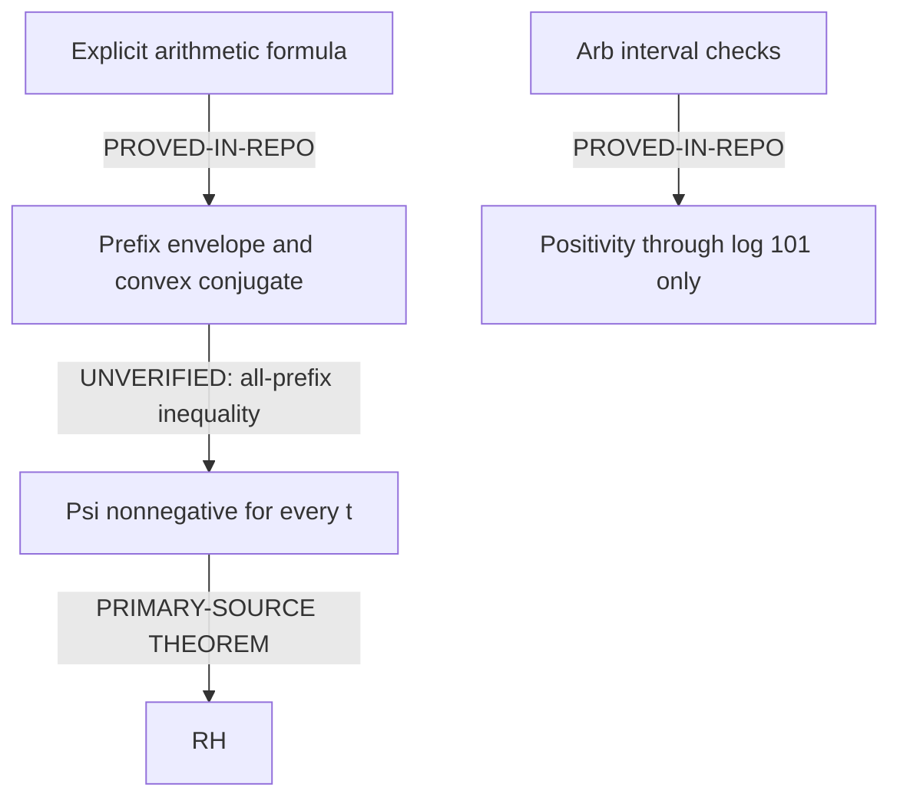

# Theorem dependency DAG

Every arrow below carries its actual status. In particular a finite sign
certificate has **no edge** to an all-event inequality.

The B-to-C edge abbreviates the missing assertion
\(H_j\ge A^*(S_j)\) for **every** prefix, followed by the proved envelope
implication. The identities alone do not imply that assertion.

## Exact positive target arrows

| From | To | Arrow status and hypotheses |
|---|---|---|
| Explicit formula | Continuity, evenness, \(\Psi(0)=0\), positive-half-line ramp system | **PROVED-IN-REPO**; locally finite event measure, convergent Lerch series |
| Rectangle convolution | Tent transform \((1-\cos tz)/z^2\) | **PROVED-IN-REPO**; endpoint value \(t^2/2\) retained |
| Arithmetic Weil formula on tent | Exact \(W(\Delta_t)=\Psi(t)\) | **PROVED-IN-REPO**; Gamma integral and interchanges checked |
| Exact event formula | Curvature, interval minima, state recurrence | **PROVED-IN-REPO** on \(t>0\); initial cusp handled separately |
| Prefix envelope | \(\Psi\ge0\) iff all \(H_j\ge A^*(S_j)\) | **PROVED-IN-REPO** plus certified initial interval; a reformulation |
| Arithmetic structure | All-prefix inequality | **UNVERIFIED**: first unpaid lemma |
| Global \(\Psi\ge0\) | RH, and converse | **PRIMARY-SOURCE THEOREM**: Suzuki 1.7, exact unmutated formula only |
| RH | Global screw PSD, and converse | **PRIMARY-SOURCE THEOREM**: Suzuki 1.2 |
| Screw PSD | \(\Psi\) CND, and converse | **PROVED-IN-REPO**: anchoring and zero-sum forms |
| Continuous even CND, normalized at zero | \(e^{-r\Psi}\) PD for every \(r\ge0\) | **PROVED-IN-REPO** finite-matrix argument; Bochner representation is a standard primary-source theorem used via Nakamura–Suzuki's probability framework |
| These PD functions | Infinite divisibility, and converse | **PROVED-IN-REPO** via continuous roots; exact hypotheses in LEVY_CND_BRIDGE |
| RH | \(e^{-\Psi}\) infinitely divisible characteristic, and converse | **PRIMARY-SOURCE THEOREM**: Nakamura–Suzuki 1.1 |
| \(e^{-\Psi}\) ordinary characteristic | \(\Psi\ge0\), hence RH | **PROVED-IN-REPO** from modulus at most one plus Suzuki |
| Continuous positive Lévy exponents converging pointwise to exact \(\Psi\) | CND of \(\Psi\) | **PROVED-IN-REPO** by passing finite forms to limit; continuity at zero required for probability closure |
| Arithmetic data | Such positive approximants / coupled Gram factor | **UNVERIFIED**; not supplied by the CLT |

## Elimination and calibration arrows

| From | To | Status |
|---|---|---|
| CND growth + exact transform | Polynomial bound on \(\Psi\) forces RH | **NEW LEMMA PROVED THIS ROUND**; elementary consequence, no priority claim |
| Above + conditional atomic measure + cosine mean-square | Finite-event rigidity including Gaussian correction | **NEW LEMMA PROVED THIS ROUND**; conditional zero data used only after deriving RH |
| Finite prime cutoff + exact completion | Exponential growth, violates CND doubling bound | **NEW LEMMA PROVED THIS ROUND**; global truncation route **REFUTED** |
| One exact event ramp | Indefinite anchored two-point matrix | **NEW LEMMA PROVED THIS ROUND**; independent PSD event-update route **REFUTED** |
| Origin cusp | No uniform first absolute Lévy-moment approximants | **NEW LEMMA PROVED THIS ROUND** |
| Independent geometric primes + unconditional PNT | CLT | **PROVED-IN-REPO**; Lyapunov proof, no RH error term |
| Exact Gaussian quotient | Modulus above one; all scalar/phase CF limits degenerate | **NEW LEMMA PROVED THIS ROUND**; canonical residual closure **REFUTED** |
| Borwein support plateau | Exact contact schedule for tent | **PROVED-IN-REPO** |
| Contact schedule / positive arithmetic masses | Positive Weil reserve | **REFUTED** by amplitude mutation |
| Convex conjugate recurrence | Monotone reserve | **REFUTED** by true arithmetic prefixes 4 and 5 |
| Finite-spectral theorem + domain and finite-height RH premise | Pinned cost upper bound | **PRIMARY-SOURCE THEOREM** plus **PROVED-IN-REPO** algebra; not an RH-free prime-only constructor |
| Pinned bound | Below every event capacity | **UNVERIFIED**; the tail is not proved |
| External \(10^{10}\) stored run + code inspection | Full sign certificate reproduced here | **UNVERIFIED**; count/rounding-method review **CORROBORATED ONLY** |
| Local Arb computation | 35 intervals and initial range | **PROVED-IN-REPO**, stated finite boundary only |

Full proofs and sources: `NORMALIZED_PROOF_TARGET.md`, `EVENT_DYNAMICS.md`,
`LEVY_CND_BRIDGE.md`, `GRAM_LEVY_ATTEMPT.md`,
`CONVOLUTION_RESIDUAL_AUDIT.md`, `CHECKPOINT_TAIL_AUDIT.md`.
Final first-gap chain: `PROOF_ATTEMPT_001.md`.
